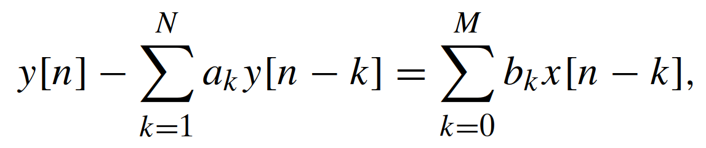
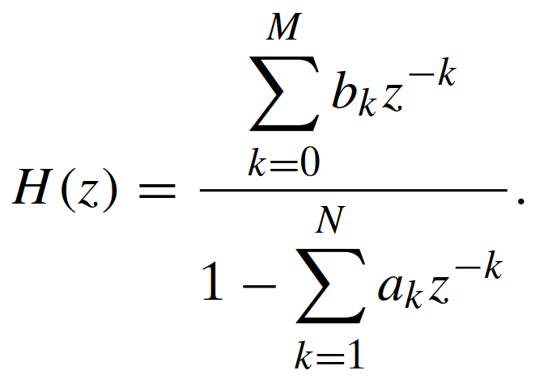
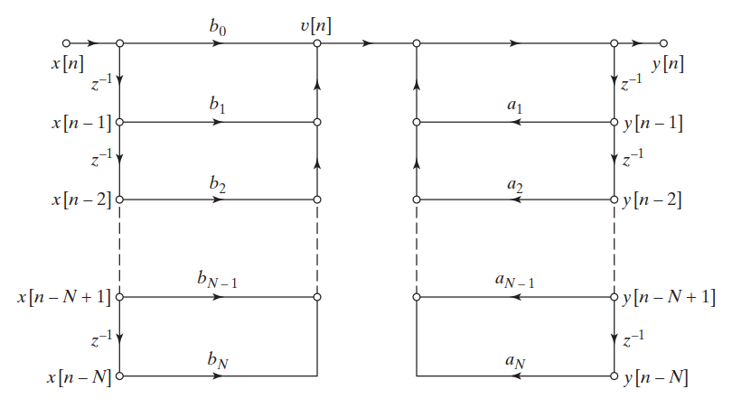
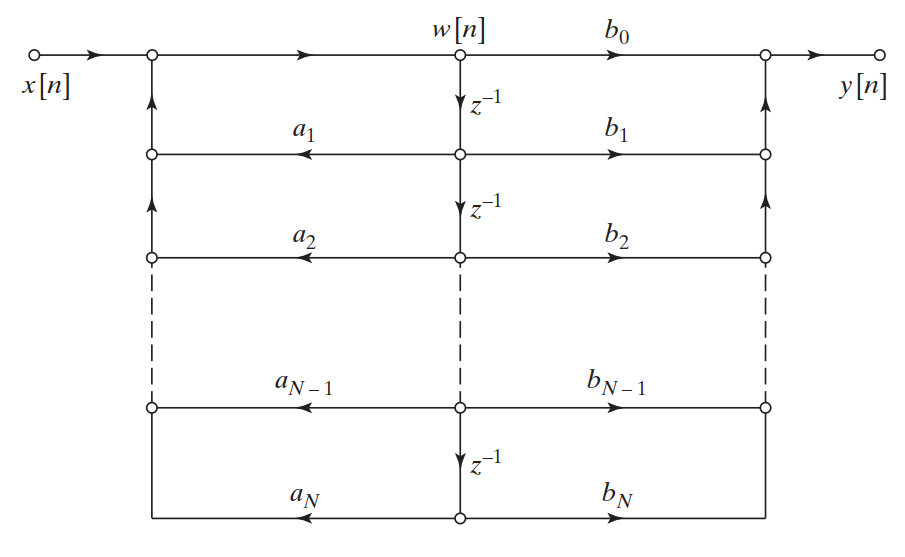
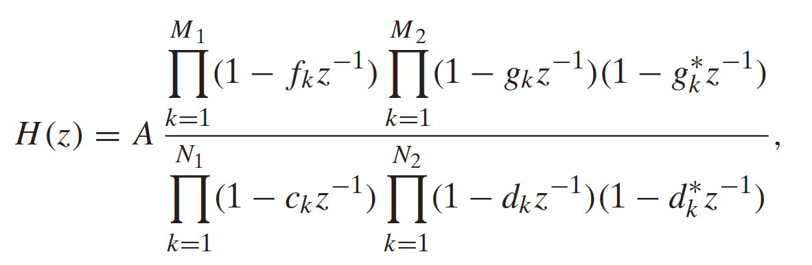
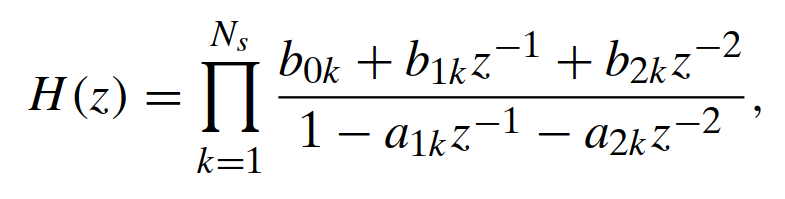
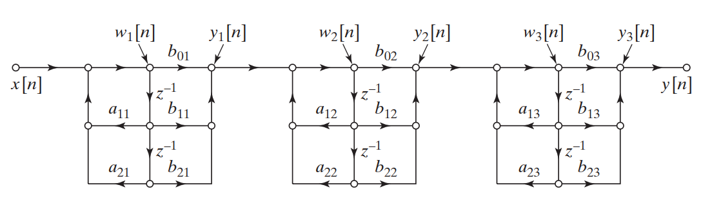
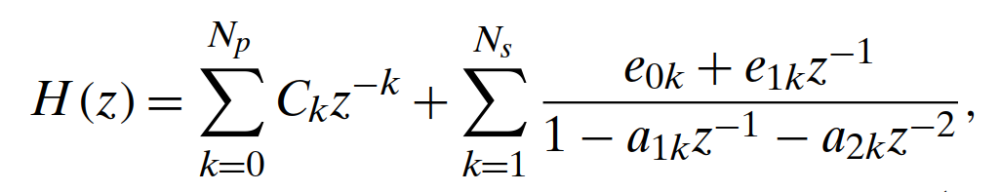
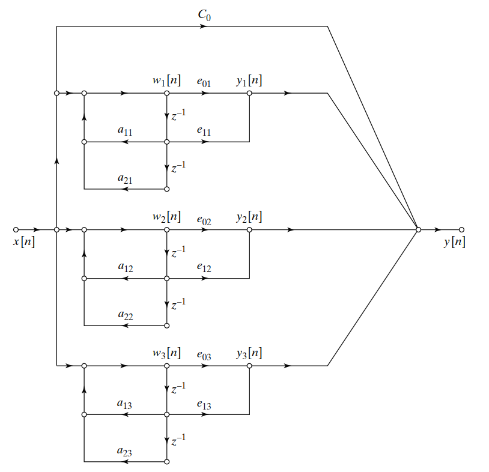

# Estruturas de Filtros IIR

Um sistema LTI que satisfaz a equação de diferença da forma: 

Possui uma resposta ao impulso correspondente:

E pode ser implementado de diferentes formas, sendo frequentemente usadas a (1) forma Direta; a (2) forma em Cascata e (3) forma Paralela.

## Formas diretas

Um sistema LTI que satisfaz a equação de diferença da forma: 

Possui uma resposta ao impulso correspondente:

Pode ser implementado na forma direta I por inspeção através da estruta da Figura_1, que mostra o diagrama em fluxo de sinais. 

Esta forma pode ser simplificada utilizando a representação em fluxo de sinais na forma direta II.

## Formas em cascata

O mesmo sistema LTI pode ser fatorado como uma razão de um produto de polinomios, onde H(z) toma a forma:

onde M = M1+2M2 e N = N1 +2N2. fk e ck são zeros reais e polos reais, e `gk, *gk, dk, *dk` são pares conjugados complexos de polos e zeros.

Pode ser escrito como um produtório de polinomios de segunda ordem:

E portanto implementado na seguinte estrutura concatenada, por inspeção:

## Formas em paralelo

Como alternativa para evitar a fatoração, o sistema pode ser implementado em paralelo expandindo a equação em frações parciais, conforme equação:

Esse sistema possui a implementação na forma paralela com a seguinte estrutura:

